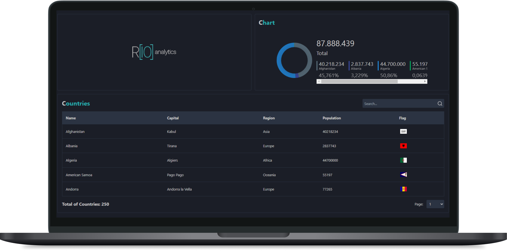
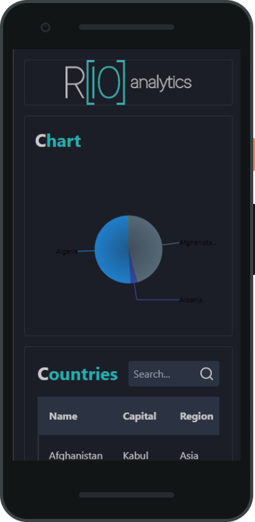

<h1 align="center">Projeto - Front-end (Angular) : Case Rio Analytics - </h1>

<p align="center">
  

  

  
  
  <a href="https://github.com/JeanGomes01/Github-Blog/commits/master">
    
  </a>
    
   <a href="https://github.com/JeanGomes01/case-rio-analytics-app/stargazers">
    
  </a>
</p>

<p align="center">Este é o front-end da aplicação **Case Rio Analytics**, desenvolvido com **Angular**. O objetivo do projeto é exibir dados de países a partir de um arquivo JSON, e também apresentar um gráfico interativo para visualização da distribuição da população por região.
 </p>

## Funcionalidades

- Exibição de uma lista de países com:
  - Nome do país
  - Capital
  - Região
  - População
  - Bandeira (imagem)
- Gráfico interativo para visualização da distribuição populacional por região

## 🚀 Tecnologias Utilizadas

- **Angular**: Framework front-end utilizado para a criação de SPAs.
- **Chart.js** ou **ngx-charts**: Para a criação de gráficos interativos.
- **TypeScript**: Linguagem para tipagem estática.
- **HTML5 e CSS3**: Para a construção e estilização do layout responsivo.

## Requisitos

Antes de começar, certifique-se de ter instalado em sua máquina:

- Node.js v14 ou superior
- NPM ou Yarn
- Angular CLI

## Instalação

### 1. Clonar o repositório

```bash
git clone https://github.com/JeanGomes01/case-rio-analytics-app.git
cd case-rio-analytics.app
```

### 2. Instalar dependências

```bash
npm install
# ou
yarn install


```

### 3. Rodar o servidor backend JSON

```
ng serve

npm start server
# ou
npx json-server src/db.json
```

```

```

### 4. Rodar aplicação Frontend

```
npm run start
# ou
ng serve
```

Isso iniciará o servidor de desenvolvimento e você poderá acessar a aplicação no navegador em `http://localhost:4200`.

## Estrutura do Projeto

```bash
├── src
│   ├── App    # Componentes reutilizáveis da interface
│   │   ├── country-list    # Componentes reutilizáveis como lista de países e gráficos
│   │   ├── dashboard-chart # Serviços para consumo de dados do JSON
│   │   ├── services      # Serviços para consumo de dados do JSON
└── README.md             # Documentação do projeto
```

## Scripts Disponíveis

- **`npm run start`**: Executa a aplicação em modo de desenvolvimento.
- **`npm start server`**: Executa a aplicação backend JSON
- **`npm run build`**: Gera a versão otimizada para produção.
- **`npm test`**: Executa os testes automatizados.

## Contribuindo

Contribuições são sempre bem-vindas! Se você encontrar problemas, sinta-se à vontade para abrir uma issue ou enviar um pull request.

## Licença

Este projeto é licenciado sob a **MIT License** - veja o arquivo [LICENSE](LICENSE) para mais detalhes.

## Roadmap

- [x] Consumo de dados estáticos do JSON.

- [x] Exibição de lista de países com Nome, Capital, Região, População e Bandeira.

- [x] Implementação de gráfico interativo para visualização da população por região.

- [x] Melhorar a estilização e responsividade da aplicação.

- [x] Implementar filtros e buscas na lista de países..

- [x] Implementar testes unitários e de integração.

- [x] Configurar deploy contínuo da aplicação.

<!-- --------------------- -->

## UI UX

|                Tela Desktop                |               Tela Mobile                |
| :----------------------------------------: | :--------------------------------------: |
|  |  |
